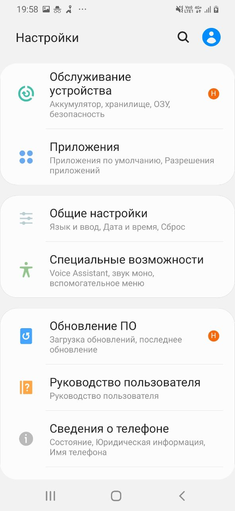
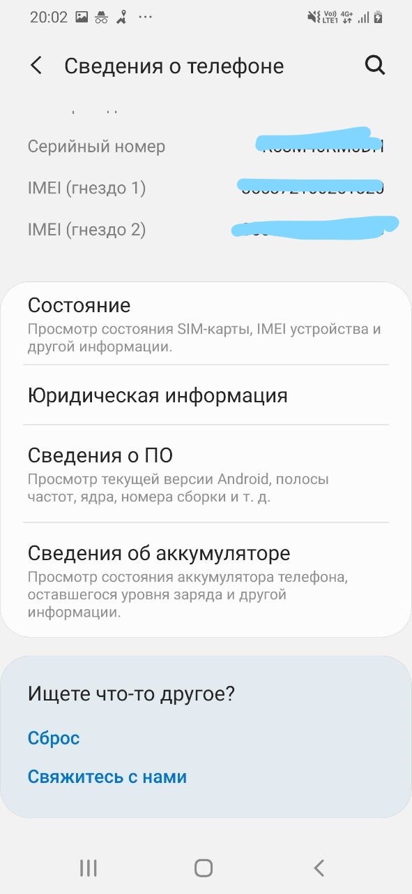
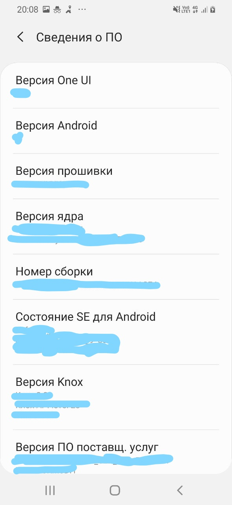
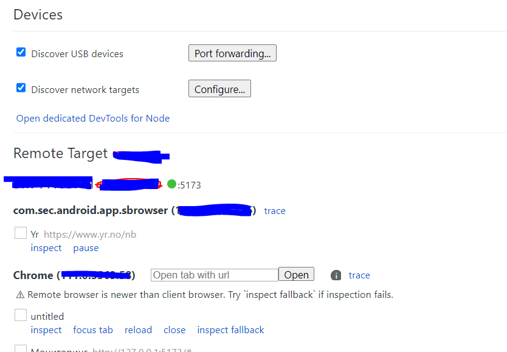
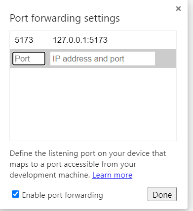

**Build and Run App on Local machine**

1. Load and install all dependencies
   npm install --force
2. Build artifacts to the dest directory
   npm run build

3. Run app on local machine with mock nodejs server :
   npm run mock
4. Run app on local machine:
   npm run dev
5. Build dist for prod and preview :
   npm run prod

Usefull Links:
https://vitejs.dev/guide/assets.html
https://vitejs.dev/guide/static-deploy.html

**Turn on dev mode on mobile (samsung/chrome)**

1) Turn dev mode on mobile:
    1. Open 'Settings' on the phone
    2. 
    3. Open 'Сведения о телефоне'
    4. 
    5. Open 'Сведения о ПО'
    6. 
    7. Tap 'Номер сброки' 7 times
    8. 'Параметры разрабочика' menu will now appear in your Settings menu
    9. Open  'Параметры разрабочика'
    10. Turn on 'Отладка по usb'
    11. Connect your phone with the development machine via usb
    12. Open chrome://inspect/#devices on your development machine
    13. 
    14. Click on 'Port forwarding' btn
    15. 
    16. Add apps IP address and port
    17. On your phone open this address in chrome browser

   
